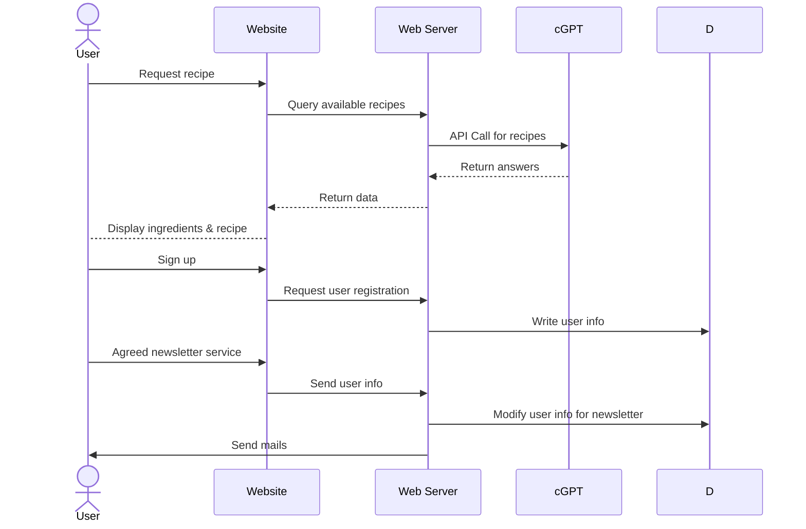
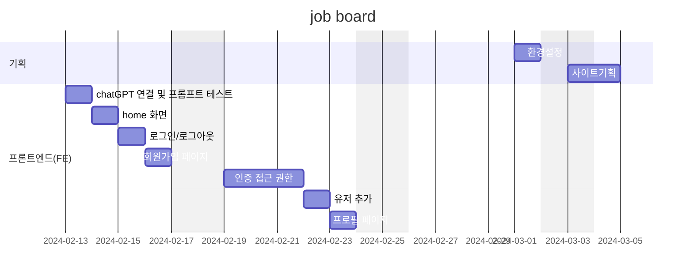

# Django Jobs

## 1. 목표와 기능
Django 관련 구인정보 제공 

### 1.1 서비스 목표
-  일반 구인사이트보다 구체적인 일자리 정보 제공 

### 1.2 시스템 기능 및 메뉴 
#### 1.2.1 시스템 기능 
- 구인정보 조회
- 구인정보 등록
- 회원가입
- 로그인
#### 1.2.2 메인 메뉴 
- Home
- 구인정보 (조회)
- 구인등록 (blog create)
- FAQ
- About Us
  . About
  . Contact
- 로그인
- 회원가입

## 2. 개발 환경 및 배포 URL
### 2.1 개발 스택
- Django 5.0.3, Bootstrap 5.2.3 

### 2.2 배포 URL
- TBD

### 2.3 URL 구조
```
#### main 
"" 
'about/' 
'contact/'
'faq/'
#### jobs 
'jobs/'    
'jobs/<int:pk>/'
'jobs/create/'
'jobs/<int:pk>/update/'
'jobs/<int:pk>/delete/'
'jobs/tag/<str:tag>/'
#### accounts
'accounts/singup/'
'accounts/login/'
'accounts/logout/'
'accounts/profile/'
'logincheck/'
```

## 3. 메인 기능 시퀀스 다이어그램 
### 3.1 메인 기능 
```
- 필수 구현 요구사항
    1. 메인페이지  
        - 페이지 제목, 로그인 및 회원가입 버튼 
    2. 회원가입 기능 
        - 회원가입을 할 수 있는 페이지 
        - 입력받는 값은 id, password 
    3. 로그인 기능 *
        - 로그인을 할 수 있는 페이지 
        - 입력받는 값은 id, password 
    4. 게시글 작성 기능 *
        - 로그인을 한 유저만 해당 기능을 사용  
        - 게시글 제목과 내용을 작성 할 수 있는 페이지 
        - 작성한 게시글이 저장되어 게시글 목록에 보임 
        - 사진 업로드가 가능.
        - 게시글 조회수가 올라감.
    5. 게시글 목록 기능 
        - 모든 사용자들이 게시한 블로그 게시글들의 제목 목록 
    6. 게시글 상세보기 기능 구현
        - 게시글의 제목/내용 이미지, 조회수 
    7. 게시글 검색 기능 구현
        - 주제와 태그에 따라 검색 
        - 게시글 목록 상단 위치함 
    8. 게시글 삭제 기능
        - 로그인을 한 유저만 해당 기능을 사용  
        - 본인의 게시글이 아니라면 수정이 불가능 
        - 삭제를 완료한 이후에 게시글 목록 화면으로 돌아감 
    10. 회원 프로필 조회 기능 
    11. 댓글 기능 
        - 댓글 추가
        - 대댓글
 ```

### 3.2 시퀀스 다이어그램  



## 4. 프로젝트 구조와 개발 일정
### 4.1 프로젝트 구조

  

 

### 4.1 개발 일정(WBS)



## 5. 와이어프레임 / UI / BM

### 5.1 화면 설계


### 5.2 실행 화면


## 6. 에러와 에러 해결

